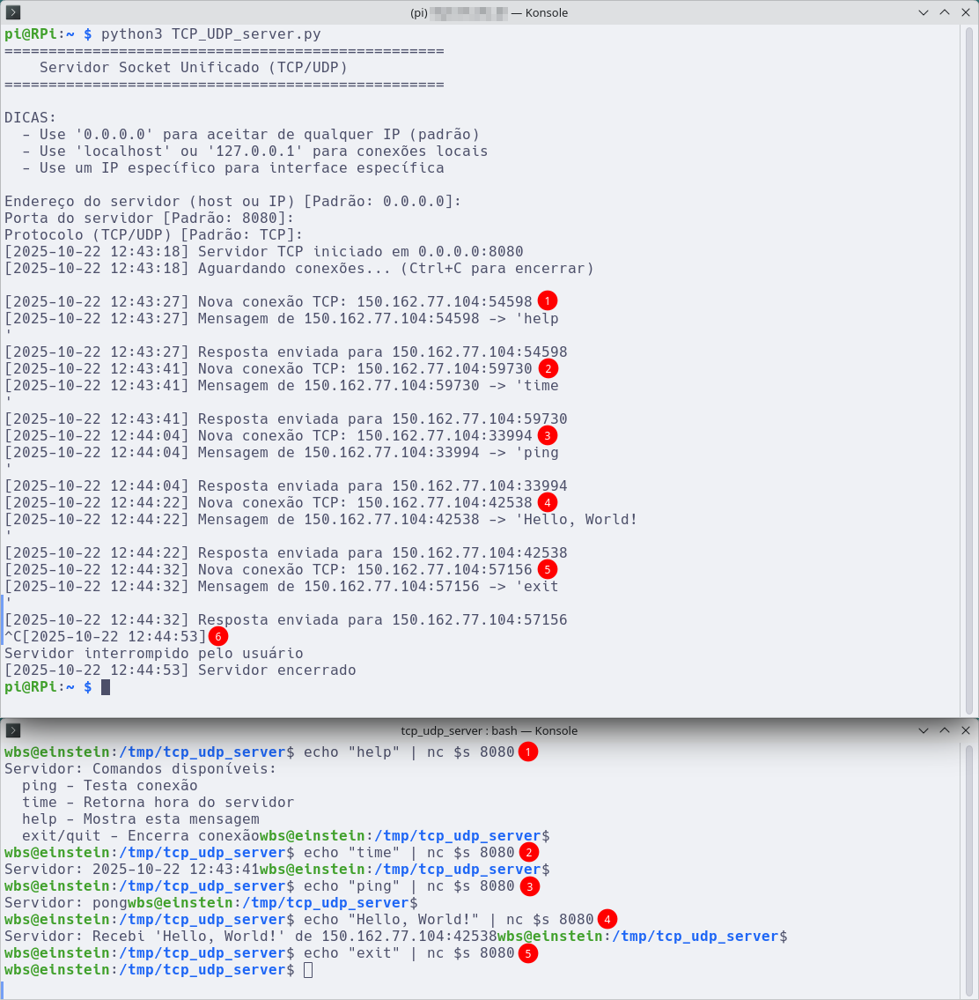

# 🌐 Servidor Socket Unificado (TCP/UDP)

Um servidor de socket educacional implementado em Python com suporte para protocolos TCP e UDP, utilizando Programação Orientada a Objetos (POO) e Type Hints.

## 📋 Descrição

Este código em Python 3 implementa um servidor de socket genérico que pode operar tanto com protocolo TCP quanto UDP. Foi desenvolvido com fins educacionais para demonstrar conceitos de programação de redes, padrões de projeto e boas práticas de desenvolvimento em Python.

### ✨ Características Principais

- 🔄 **Suporte duplo**: Funciona com TCP ou UDP.
- 🏗️ **Arquitetura orientada a objetos**: Uso de classes abstratas e padrão Factory.
- 📝 **Type Hints**: Código totalmente tipado para melhor documentação e IDE support.
- ⏱️ **Timeout automático**: Encerra após 5 minutos de inatividade.
- 📊 **Logging detalhado**: Registro de todas as operações com timestamp.
- 🎯 **Comandos especiais**: ping, time, help, exit/quit.
- 🔒 **Tratamento de erros**: Gerenciamento robusto de exceções.


## 📚 Recursos Educacionais

Este projeto demonstra:

- ✅ Programação de sockets em Python.
- ✅ Padrões de projeto (Factory, Template Method).
- ✅ Programação Orientada a Objetos.
- ✅ Type Hints e anotações de tipo.
- ✅ Classes abstratas e interfaces.
- ✅ Tratamento de exceções.
- ✅ Context managers e recursos.
- ✅ Enums e tipos personalizados.
- ✅ Logging e debugging.


## 🚀 Funcionalidades

### Protocolos Suportados

#### TCP (Transmission Control Protocol)
- Orientado a conexão.
- Confiável e ordenado.
- Mantém estado da conexão.
- Ideal para transferências que requerem garantia de entrega.

#### UDP (User Datagram Protocol)
- Sem conexão.
- Mais rápido e leve.
- Não garante entrega ou ordem.
- Ideal para aplicações em tempo real.

### Comandos Disponíveis

| Comando | Descrição |
|---------|-----------|
| `ping` | Testa a conectividade (responde "pong") |
| `time` | Retorna a data/hora atual do servidor |
| `help` | Lista todos os comandos disponíveis |
| `exit` / `quit` | Encerra a conexão |
| Qualquer outro texto | Eco da mensagem com informações do remetente |

## 📦 Requisitos

- Python 3.6 ou superior
- Bibliotecas padrão do Python (não requer instalação adicional):
  - `socket`
  - `signal`
  - `datetime`
  - `typing`
  - `abc`
  - `enum`

## 🔧 Instalação

1. Clone o repositório:
```bash
git clone https://github.com/wyllianbs/tcp-udp-server.git
cd tcp-udp-server
```

2. Certifique-se de ter Python 3.6+ instalado:
```bash
python3 --version
```

3. Torne o arquivo executável (opcional):
```bash
chmod +x TCP_UDP_server.py
```

## 💻 Uso

### Iniciando o Servidor

Execute o script:
```bash
python3 TCP_UDP_server.py
```

O servidor solicitará as seguintes informações:

1. **Endereço** (padrão: `0.0.0.0`):
   - `0.0.0.0` - Aceita conexões de qualquer interface de rede.
   - `localhost` ou `127.0.0.1` - Apenas conexões locais.
   - IP específico - Bind em interface específica.

2. **Porta** (padrão: `8080`):
   - Valores válidos: 1-65535.
   - Portas < 1024 requerem privilégios de administrador.

3. **Protocolo** (padrão: `TCP`):
   - `TCP` - Para conexões confiáveis.
   - `UDP` - Para comunicação sem conexão.

### Exemplo de Uso

```
==================================================
    Servidor Socket Unificado (TCP/UDP)
==================================================

DICAS:
  - Use '0.0.0.0' para aceitar de qualquer IP (padrão)
  - Use 'localhost' ou '127.0.0.1' para conexões locais
  - Use um IP específico para interface específica

Endereço do servidor (host ou IP) [Padrão: 0.0.0.0]: 
Porta do servidor [Padrão: 8080]: 
Protocolo (TCP/UDP) [Padrão: TCP]: TCP

[2025-10-22 14:30:15] Servidor TCP iniciado em 0.0.0.0:8080
[2025-10-22 14:30:15] Aguardando conexões... (Ctrl+C para encerrar)
```

### Testando o Servidor

#### Usando netcat (TCP):
```bash
nc localhost 8080
```

#### Usando netcat (UDP):
```bash
nc -u localhost 8080
```

#### Usando telnet (TCP apenas):
```bash
telnet localhost 8080
```

#### Usando Python (exemplo de cliente):
```python
import socket

# Cliente TCP
sock = socket.socket(socket.AF_INET, socket.SOCK_STREAM)
sock.connect(('localhost', 8080))
sock.send(b'ping')
response = sock.recv(1024)
print(response.decode())
sock.close()
```


## 📊 Exemplo



Em (6), foi digitado Ctrl+C para encerrar o server. Entretanto, caso o server fique inativo por 5 minutos (300 s), será encerrada a escuta.


## 🏗️ Arquitetura

O projeto utiliza os seguintes padrões de projeto e conceitos:

### Padrões de Projeto

- **Factory Pattern**: `ServerFactory` cria instâncias apropriadas de servidor.
- **Template Method**: `SocketServer` define estrutura comum, subclasses implementam detalhes.
- **Strategy Pattern**: Diferentes estratégias de comunicação (TCP/UDP).

### Estrutura de Classes

```
ServerApplication
    └── ServerFactory
        ├── TCPServer (extends SocketServer)
        └── UDPServer (extends SocketServer)
            ├── MessageHandler
            ├── Logger
            └── TimeoutHandler
```

### Componentes Principais

- **`SocketServer`**: Classe abstrata base para servidores.
- **`TCPServer`**: Implementação do servidor TCP.
- **`UDPServer`**: Implementação do servidor UDP.
- **`ServerFactory`**: Factory para criar servidores.
- **`MessageHandler`**: Processa lógica de negócio das mensagens.
- **`Logger`**: Sistema de logging com timestamps.
- **`TimeoutHandler`**: Gerencia timeout de inatividade.
- **`Protocol`**: Enum para protocolos disponíveis.
- **`ServerApplication`**: Aplicação principal.

## 🔐 Segurança

### Considerações de Segurança

⚠️ **ATENÇÃO**: Este servidor foi desenvolvido para fins educacionais e não deve ser usado em produção sem as seguintes considerações:

- Não implementa autenticação.
- Não possui criptografia de dados.
- Não tem proteção contra ataques DDoS.
- Não valida ou sanitiza inputs complexos.
- Processa apenas uma conexão TCP por vez.

### Recomendações para Uso em Produção

Se você planeja usar este código como base para um servidor de produção:

1. Implemente autenticação e autorização.
2. Use TLS/SSL para criptografia.
3. Adicione rate limiting e proteção contra floods.
4. Implemente validação e sanitização robusta de inputs.
5. Use threading ou async para múltiplas conexões simultâneas.
6. Adicione monitoramento e alertas.
7. Implemente logs estruturados para análise.

## 🧪 Testes

### Teste de Conectividade
```bash
# Terminal 1: Inicie o servidor
python3 TCP_UDP_server.py

# Terminal 2: Teste com ping
echo "ping" | nc localhost 8080
# Resposta esperada: Servidor: pong
```

### Teste de Comandos
```bash
# Teste comando time
echo "time" | nc localhost 8080

# Teste comando help
echo "help" | nc localhost 8080

# Teste eco de mensagem
echo "Hello, World!" | nc localhost 8080
```

## 🐛 Solução de Problemas

### Erro: "Address already in use"
```bash
# Verifique se a porta está em uso
lsof -i :8080

# Mate o processo usando a porta
kill -9 <PID>

# Ou use uma porta diferente
```

### Erro: "Permission denied" (Porta < 1024)
```bash
# Execute com sudo (não recomendado) ou use porta > 1024
sudo python3 TCP_UDP_server.py
```

### Timeout muito curto/longo
Modifique o valor no código:
```python
self.timeout_handler = TimeoutHandler(timeout=300)  # 300 segundos = 5 minutos
```


## Código Relacionado
- [Cliente Socket Unificado (TCP/UDP)](https://github.com/wyllianbs/tcp-udp-client).


## 📖 Recursos Adicionais

### Documentação Python
- [Socket Programming](https://docs.python.org/3/howto/sockets.html).
- [ABC - Abstract Base Classes](https://docs.python.org/3/library/abc.html).
- [Type Hints](https://docs.python.org/3/library/typing.html).

### RFCs Relevantes
- [RFC 793 - TCP](https://tools.ietf.org/html/rfc793).
- [RFC 768 - UDP](https://tools.ietf.org/html/rfc768).
- [RFC 1122 - Internet Host Requirements](https://tools.ietf.org/html/rfc1122).


## 📜 Licença

Este projeto está licenciado sob a Licença [GNU General Public License v3.0](LICENSE).

## 👤 Autor

**Prof. Wyllian B. da Silva**  
Departamento de Informática e Estatística (INE)  
Universidade Federal de Santa Catarina (UFSC)

---

**Nota**: Este projeto foi desenvolvido especificamente para uso na UFSC, mas pode ser facilmente adaptado para outras instituições de ensino.
